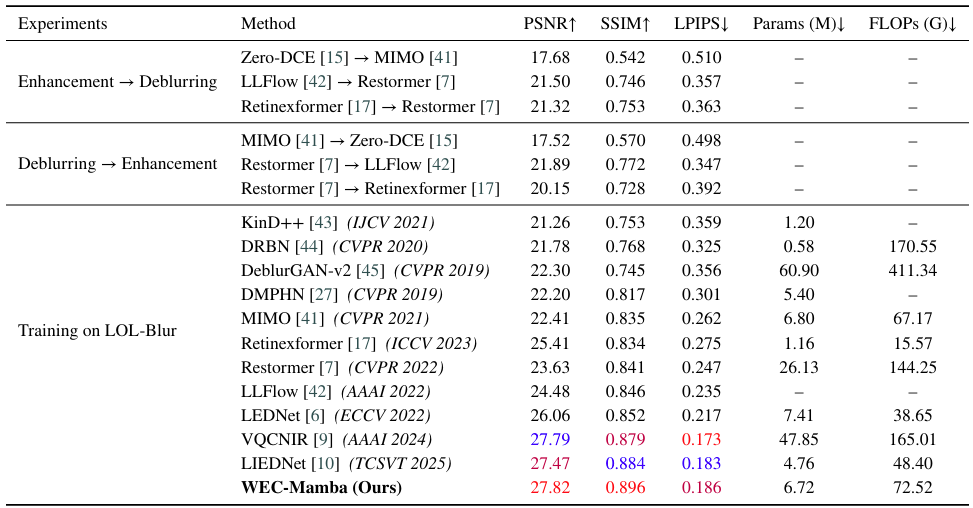
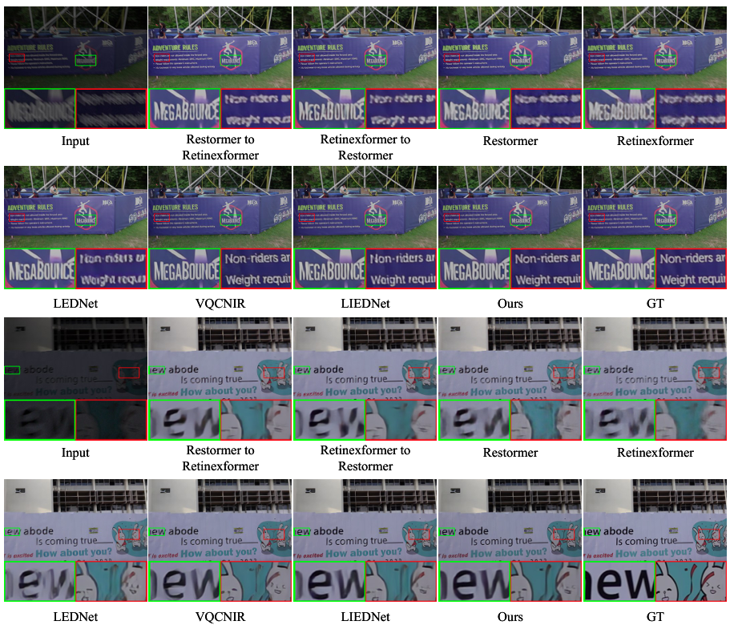

# WEC-Mamba: Wavelet-Based Edge Compensation Mamba for Joint  Low-Light Image Enhancement and Deblurring
## Abstract
Joint low-light image enhancement and deblurring is a challenging image restoration task, since
insufficient illumination and motion blur are often strongly coupled in real-world scenes and jointly
degrade structural and textural information. Although existing methods have achieved promising
progress, they still struggle to recover fine details, especially high-frequency components that are
severely attenuated under coupled degradations. As a result, restored images often exhibit blurred
edges, over-smoothed textures, and incomplete local structures.
To address this issue, we propose WEC-Mamba, a unified framework for joint low-light image
enhancement and deblurring. The proposed network is built upon a dedicated Local Enhanced
Mamba Block, which consists of a Wavelet-Enhanced State Space Module (WESM) and a
Multi-Scale Channel Refinement Module (MSCR). Specifically, WESM integrates wavelet-based
local detail compensation into state space modeling to better preserve and recover high-frequency
information suppressed by coupled low-light and blur degradations, while MSCR further refines
degraded structures through multi-scale context aggregation and adaptive channel modulation. In
addition, we introduce a frequency-domain loss and adopt a two-stage training strategy to further
improve restoration quality.
Extensive experiments on synthetic and real-world low-light blurry datasets, as well as standard
low-light enhancement benchmarks, demonstrate that the proposed methodachieves strong qualitative
performance and competitive quantitative results compared with existing state-of-the-art methods.
These results suggest the effectiveness of the proposed design for handling complex coupled degrada
tions in low-light image restoration. The code is available at https://github.com/ZehuaChenLab/WEC-Mamba.

## Quantitative comparisons results on the LOL-Blur dataset.

## Qualitative comparison results on the LOL-Blur dataset.

### The code will be released soon
